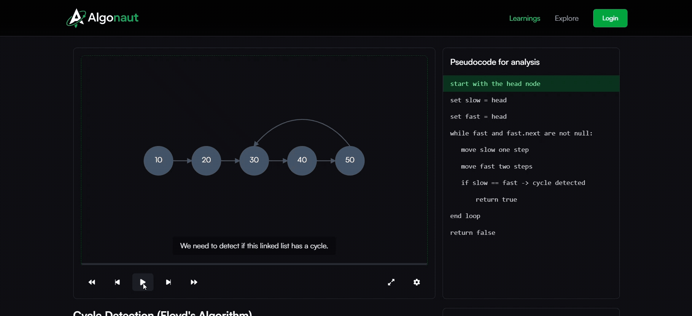

<p align="center">
  
</p>

An interactive platform to **visualize algorithms step-by-step**, explore their pseudocode, and test your understanding with quizzes.  
Built with **React + Firebase** for smooth UI, authentication, progress tracking, notes, and bookmarks.

<p align="center">
  
</p>

## Features

- **Interactive Visualizations** – Watch algorithms run step by step.  
- **Pseudocode & Explanations** – Learn with side-by-side explanations.  
- **Notes** – Add personal notes for each algorithm.  
- **Bookmarks** – Save algorithms for quick access.  
- **Progress Tracking** – Track completed visualizations & quizzes.  
- **Quizzes** – Test your understanding after each visualization.  
- **Dashboard** – See your overall progress & topics covered.  

## Tech Stack

- **Frontend**: React+Vite, TailwindCSS, Framer Motion  
- **State Management**: React Context API  
- **Database & Auth**: Firebase (Auth, Firestore)  
- **Icons & UI**: React Icons
  
## Getting Started

### 1. Clone the repo
```bash
git clone https://github.com/himzz1234/algonaut.git
cd algonaut
```

### 2. Install dependencies
```bash
npm install
```

### 3. Setup Firebase
- Create a Firebase project
- Enable **Firestore** and **Authentication**
- Add your Firebase config in `/src/lib/firebase.ts`

```ts
// firebase.ts
import { initializeApp } from "firebase/app";
import { getFirestore } from "firebase/firestore";
import { getAuth } from "firebase/auth";

const firebaseConfig = { /* your config here */ };

const app = initializeApp(firebaseConfig);
export const db = getFirestore(app);
export const auth = getAuth(app);
```

### 4. Run the app
```bash
npm run dev
```

## Roadmap

- [ ] Add more algorithms & data structures  
- [ ] Improve quiz question variety  
- [ ] Add leaderboard  
- [ ] Export/share progress  
- [ ] Export visualizations as MP4/GIF
- [ ] AI-powered explanations (e.g., time complexity, code walkthroughs)
- [ ] Edge test cases for deeper clarity
- [ ] Achievement badges
- [ ] Daily streaks

## Contributing

Contributions are welcome!  
1. Fork the repo  
2. Create a new branch (`git checkout -b feature/xyz`)  
3. Commit your changes  
4. Open a Pull Request  

## License

MIT License © 2025 Algonaut 
